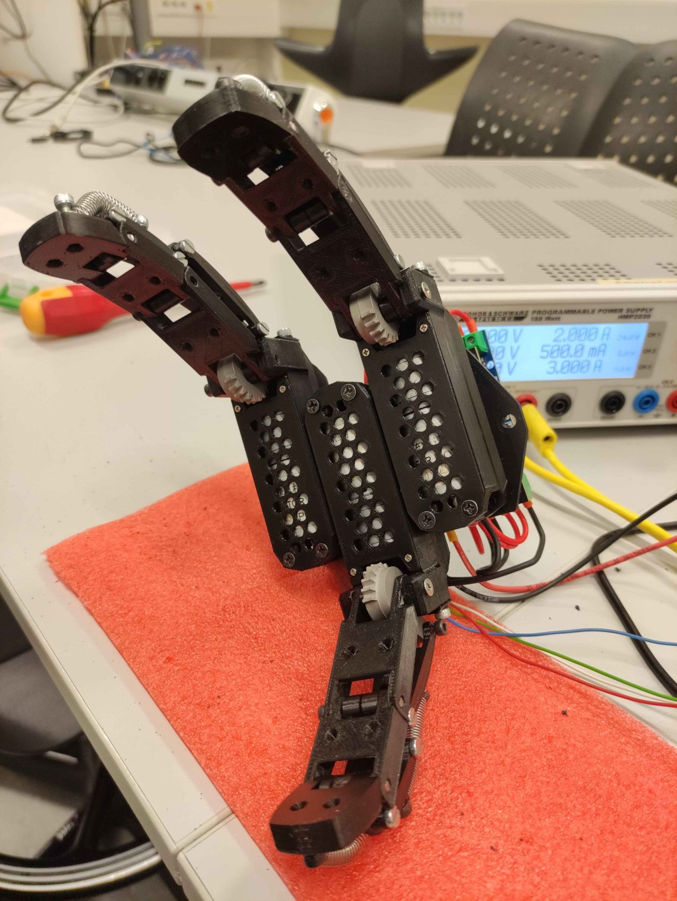

# Electric Prosthesis with MAX30105 

This project demonstrates an electric prosthesis that uses current sensors to detect force and the MAX30105 sensor to measure muscle density with infrared light.

## Pictures

